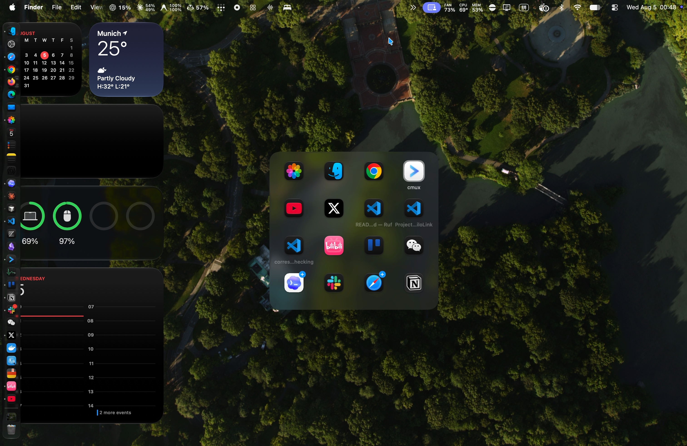

# Ruf

A lightweight macOS app and window switcher with a matrix layout and
keyboard-first window controls.



## Features

- Switch between apps and windows in a compact, recent-first matrix. Ruf
  restores minimized windows and reopens apps with no open windows.
- Open a new window through the selected app's menu, or quit it without
  activating it first.
- Move a focused, non-full-screen window to an adjacent display without
  changing its size or relative position.
- See Dock badges directly on app icons in the switcher.
- Choose Ruf or macOS for Command-Tab, and control menu bar visibility and
  launch at login.

> Open Ruf Settings for the complete keyboard shortcut reference.

## Requirements

- macOS 26 or later
- Accessibility permission, used to capture global keyboard shortcuts and
  enumerate, activate, and move application windows

## Build and run

```sh
swift test
./script/build_and_run.sh
```

To create optimized universal artifacts without launching Ruf, run:

```sh
./script/build_and_run.sh --package
```

This writes `dist/Ruf.app` and `dist/Ruf.dmg`. Distribution signing and
automated publishing are documented in [RELEASING.md](RELEASING.md).
